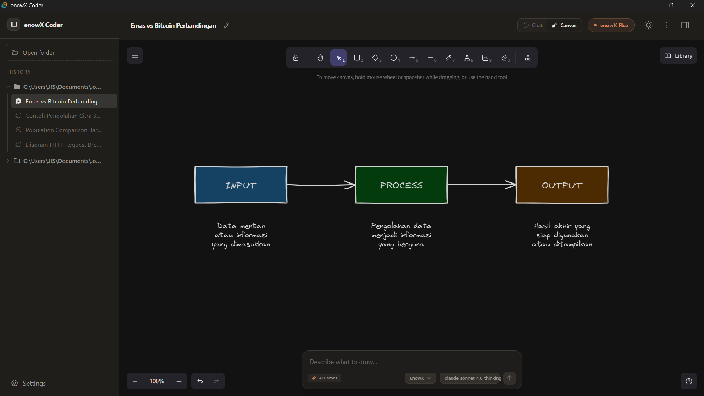
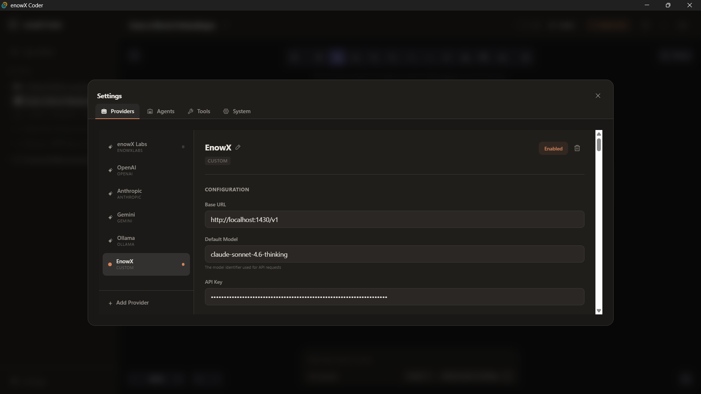

<div align="center">

# 🚀 enowX Coder

**Agentic Coding Tools - AI-Powered Development Assistant**

[](LICENSE)
[](https://tauri.app)
[](https://react.dev)
[](https://www.rust-lang.org)
[](https://www.typescriptlang.org)

*A powerful desktop application that combines AI agents with an intuitive interface for enhanced coding workflows*

[Features](#-features) • [Installation](#-installation) • [Usage](#-usage) • [Architecture](#-architecture) • [Contributing](#-contributing)

</div>

---

## ✨ Features

### 🤖 AI-Powered Chat Interface
- **Multi-Provider Support**: Connect to enowX Labs, OpenAI, Anthropic, Google, or custom providers
- **Conversation Memory**: Smart context management with sliding window (up to 20 message pairs)
- **Agent Execution Timeline**: Visual representation of AI thinking process, tool usage, and results
- **Markdown Rendering**: Full GitHub-flavored markdown with syntax highlighting
- **Code Block Actions**: Copy, execute, or preview code directly from chat

### 🎨 Excalidraw Canvas Integration
- **Collaborative Whiteboard**: Full-featured drawing canvas with shapes, arrows, text, and freehand tools
- **AI-Generated Diagrams**: Describe what you want to draw, AI generates native Excalidraw elements
- **Context-Aware Editing**: AI understands existing canvas elements for precise modifications
- **Auto-Save**: Drawings persist per project with 1-second auto-save
- **Theme Sync**: Dark/light mode automatically syncs with app theme

### 🛠️ Advanced Agent System
- **Multiple Specialized Agents**: Orchestrator, Planner, Coder (FE/BE), Tester, Reviewer, Security, and more
- **Tool Execution**: File operations, shell commands, web scraping, and custom tools
- **Permission System**: User approval required for sensitive operations
- **Streaming Responses**: Real-time token streaming for immediate feedback

### 🎯 Project Management
- **Multi-Project Support**: Switch between projects seamlessly
- **Session History**: Persistent chat sessions per project
- **SQLite Backend**: Fast, reliable local storage for all data

### 🌓 Beautiful UI/UX
- **Warm Dark Mode**: Claude-inspired color palette with terracotta accents
- **Responsive Layout**: Three-panel layout with collapsible sidebars
- **Smooth Animations**: Polished transitions and micro-interactions
- **Accessibility**: Keyboard shortcuts and screen reader support

---

## 📸 Screenshots

### enowX Flux - AI Chat Interface
*Powerful AI-powered conversations with enowX Flux integration and warm Claude-inspired dark theme*


### Chat Interface - Light Mode
*Clean and modern light theme for comfortable daytime coding*


### Excalidraw Canvas
*Collaborative whiteboard with AI diagram generation*



### Provider Settings
*Manage multiple AI providers and models with enable/disable toggles*



---

## 🚀 Installation

### Prerequisites
- **Node.js** 18+ or **Bun** 1.0+
- **Rust** 1.75+ (for Tauri)
- **Git**

### Quick Start

```bash
# Clone the repository
git clone https://github.com/mhmmadazis/enowX-Coder.git
cd enowX-Coder

# Install dependencies
npm install
# or
bun install

# Run in development mode
npm run tauri dev
# or
bun run tauri dev
```

### Build for Production

```bash
# Build the application
npm run tauri build
# or
bun run tauri build
```

The compiled application will be available in `src-tauri/target/release/bundle/`.

---

## 🎯 Usage

### Getting Started

1. **Launch the Application**
   - Run `npm run tauri dev` or open the built executable

2. **Configure AI Provider**
   - Click the settings icon (⚙️) in the top-right corner
   - Navigate to "Providers" tab
   - Add your API key for enowX Labs, OpenAI, Anthropic, or custom provider
   - Enable the provider and select a model

3. **Create a Project**
   - Click "New Project" in the left sidebar
   - Enter project name and optional path
   - Start chatting with AI agents

### Chat Commands

- **Ask Questions**: Type naturally, AI understands context
- **Request Code**: "Create a React component for user authentication"
- **Execute Tools**: AI can read/write files, run shell commands (with permission)
- **Generate Diagrams**: Switch to Canvas tab and describe what to draw

### Canvas Mode

1. **Switch to Canvas**: Click "Canvas" in the header segmented control
2. **Draw Manually**: Use Excalidraw toolbar for shapes, arrows, text
3. **AI Generation**: Type prompt in bottom bar (e.g., "Draw a system architecture diagram")
4. **Edit with AI**: "Change the color of Database to blue" - AI modifies only that element

### Keyboard Shortcuts

- `Ctrl/Cmd + N` - New chat session
- `Ctrl/Cmd + ,` - Open settings
- `Ctrl/Cmd + B` - Toggle left sidebar
- `Ctrl/Cmd + Shift + B` - Toggle right sidebar
- `Esc` - Close dialogs/modals

---

## 🏗️ Architecture

### Tech Stack

**Frontend**
- **React 19** - UI framework with concurrent features
- **TypeScript** - Type-safe development
- **Tailwind CSS 4** - Utility-first styling
- **Zustand** - Lightweight state management
- **Excalidraw** - Canvas whiteboard library

**Backend**
- **Rust** - High-performance, memory-safe backend
- **Tauri 2** - Cross-platform desktop framework
- **SQLite** - Embedded database via rusqlite
- **Tokio** - Async runtime for concurrent operations

### Project Structure

```
enowX-Coder/
├── src/                      # React frontend
│   ├── components/           # UI components
│   │   ├── chat/            # Chat interface components
│   │   ├── canvas/          # Excalidraw canvas
│   │   ├── layout/          # App shell and layout
│   │   ├── settings/        # Settings panels
│   │   └── ui/              # Reusable UI primitives
│   ├── stores/              # Zustand state stores
│   ├── types/               # TypeScript type definitions
│   └── lib/                 # Utility functions
│
├── src-tauri/               # Rust backend
│   ├── src/
│   │   ├── agents/          # AI agent implementations
│   │   ├── commands/        # Tauri commands (IPC)
│   │   ├── services/        # Business logic layer
│   │   ├── models/          # Data models
│   │   ├── tools/           # Agent tool executors
│   │   └── state.rs         # Application state
│   ├── migrations/          # SQLite schema migrations
│   └── Cargo.toml           # Rust dependencies
│
├── public/                  # Static assets
├── screenshots/             # Application screenshots
└── CHANGELOG.md            # Version history
```

### Key Components

**Agent System** (`src-tauri/src/agents/`)
- `runner.rs` - Main agent execution loop with ReAct pattern
- `prompts/` - Specialized agent prompts (Orchestrator, Coder, Tester, etc.)

**Services** (`src-tauri/src/services/`)
- `chat_service.rs` - Message handling, streaming, conversation memory
- `provider_service.rs` - AI provider management and API calls
- `drawing_service.rs` - Canvas persistence and AI diagram generation
- `agent_service.rs` - Agent configuration and execution

**State Management**
- Frontend: Zustand stores for UI state, chat, projects, settings
- Backend: Tauri managed state with Arc<Mutex<>> for thread-safe access

---

## 🔧 Configuration

### Environment Variables

Create a `.env` file in the project root (optional):

```env
# Default AI Provider
DEFAULT_PROVIDER=enowx-labs

# API Keys (can also be set in UI)
ENOWX_API_KEY=your_key_here
OPENAI_API_KEY=your_key_here
ANTHROPIC_API_KEY=your_key_here
```

### Custom Providers

Add custom AI providers via Settings UI:
1. Click "+ Add Provider"
2. Enter provider name, base URL, and API key
3. Add models manually or fetch from API
4. Enable provider and select model

---

## 🤝 Contributing

Contributions are welcome! Please follow these guidelines:

1. **Fork the repository**
2. **Create a feature branch**: `git checkout -b feature/amazing-feature`
3. **Commit your changes**: `git commit -m 'feat: add amazing feature'`
4. **Push to the branch**: `git push origin feature/amazing-feature`
5. **Open a Pull Request**

### Commit Convention

Follow [Conventional Commits](https://www.conventionalcommits.org/):
- `feat:` - New feature
- `fix:` - Bug fix
- `refactor:` - Code refactoring
- `docs:` - Documentation changes
- `chore:` - Maintenance tasks
- `test:` - Test additions/changes

### Development Guidelines

- Run `cargo clippy` before committing Rust code
- Run `npm run build` to check TypeScript compilation
- Test on multiple platforms (Windows, macOS, Linux)
- Update CHANGELOG.md for notable changes

---

## 📝 License

This project is licensed under the **Apache License 2.0** - see the [LICENSE](LICENSE) file for details.

---

## 🙏 Acknowledgments

- **Tauri Team** - For the amazing cross-platform framework
- **Excalidraw** - For the collaborative whiteboard library
- **Anthropic** - For Claude AI inspiration and design patterns
- **enowX Labs** - For AI infrastructure and model access

---

## 📞 Support

- **Issues**: [GitHub Issues](https://github.com/mhmmadazis/enowX-Coder/issues)
- **Discussions**: [GitHub Discussions](https://github.com/mhmmadazis/enowX-Coder/discussions)
- **Email**: support@enowx.dev

---

<div align="center">

**Built with ❤️ by the enowX Community**

⭐ Star this repo if you find it useful!

</div>
